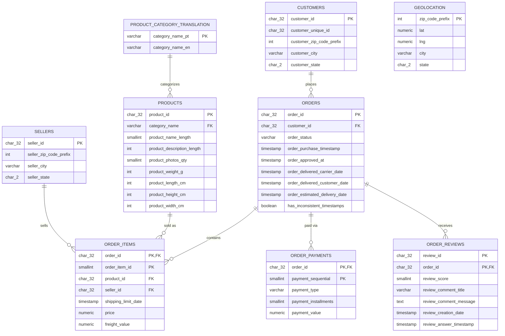

# Olist E-Commerce Analytics

**From raw, imperfect e-commerce data to a documented relational database, business insights, and a machine learning model — a self-contained SQL and Data Analytics portfolio project.**

## Table of Contents

- [Business Context](#business-context)
- [Data Source](#data-source)
- [Repository Structure](#repository-structure)
- [Key Findings](#key-findings)
- [Tech Stack](#tech-stack)
- [Quickstart](#quickstart)
    - [Requirements](#requirements)
    - [Install the environment](#install-the-environment)
    - [Download the dataset](#download-the-dataset)
- [Usage](#usage)
    - [Run the full pipeline](#run-the-full-pipeline)
    - [Run the ML notebook](#run-the-ml-notebook)
- [Methodology](#methodology)
    - [Project Pipeline](#project-pipeline)
    - [Data Model (Entity-Relationship Diagram)](#data-model-entity-relationship-diagram)
    - [Data Quality & ETL](#data-quality--etl)
    - [Business Analyses](#business-analyses)
    - [Machine Learning: Predicting Customer Dissatisfaction](#machine-learning-predicting-customer-dissatisfaction)
- [Limitations & Possible Next Steps](#limitations--possible-next-steps)
- [License](#license)

---

## Business Context

Olist is a Brazilian marketplace that lets small and medium businesses sell through major e-commerce channels while Olist handles logistics, payments and customer relations. This project simulates the day-to-day work of a **Data Analyst / Analytics Engineer** joining that kind of marketplace: raw operational data arrives spread across several imperfect tables, and the job is to turn it into a trustworthy database, answer real business questions, and support a concrete business decision with a lightweight predictive model.

The stakes are typical of any marketplace business: acquiring a customer is expensive, so **customer satisfaction and delivery reliability are direct levers on repeat business and word-of-mouth**. This project follows that thread end to end — from raw CSVs to a relational database, to business analyses, to a model that tests which factors actually drive dissatisfaction.

The full pipeline is built and documented in 9 stages: data exploration, data quality audit, relational schema design, ETL, automated validation tests, business analyses in SQL, and feature engineering + ML.

## Data Source

[Brazilian E-Commerce Public Dataset by Olist](https://www.kaggle.com/datasets/olistbr/brazilian-ecommerce) (Kaggle) — real, anonymized commercial data covering ~100,000 orders placed on the Olist marketplace between 2016 and 2018, spread across 9 CSV files (orders, order items, payments, reviews, products, customers, sellers, geolocation, and a category name translation table).

## Repository Structure

```
.
├── data/
│   └── raw/                                # ignored by git — populated by scripts/download_data.py
├── docs/
│   ├── 03_exploration_notes.md             # ignored by git — personal working notes
│   └── 04_data_quality.md                  # data quality audit (stage 4)
├── notebooks/
│   └── dissatisfaction_model.ipynb         # ML notebook (stage 8)
├── scripts/
│   └── download_data.py                    # downloads the Kaggle dataset into data/raw/
├── sql/
│   ├── 01_create_staging_tables.sql        # stage 2: staging schema
│   ├── 02_load_staging.sql                 # stage 2: load raw CSVs into staging
│   ├── 04_audit_data_quality.sql           # stage 4: data quality audit queries
│   ├── 05_create_core_tables.sql           # stage 5: core schema (types, PK, FK, CHECK)
│   ├── 06_run_etl.sql                      # stage 6: runs the 9 ETL files in dependency order
│   ├── etl/                                # stage 6: staging -> core, one file per table
│   │   ├── 01_product_category_translation.sql
│   │   ├── 02_geolocation.sql
│   │   ├── 03_customers.sql
│   │   ├── 04_sellers.sql
│   │   ├── 05_products.sql
│   │   ├── 06_orders.sql
│   │   ├── 07_order_items.sql
│   │   ├── 08_order_payments.sql
│   │   └── 09_order_reviews.sql
│   ├── tests/
│   │   └── validate_core.sql               # post-ETL validation checks
│   ├── analysis/                           # stage 7: business analyses
│   │   ├── 01_delivery_delay_vs_estimate.sql
│   │   ├── 02_late_delivery_review_impact.sql
│   │   ├── 03_customer_rfm_segmentation.sql
│   │   ├── 04_recurring_customer_rate.sql
│   │   ├── 05_monthly_revenue_growth.sql
│   │   ├── 06_top_categories_by_revenue.sql
│   │   ├── 07_late_delivery_rate_by_state.sql
│   │   ├── 08_avg_review_score_by_category.sql
│   │   ├── 09_seller_ratings_best_worst.sql
│   │   └── 10_basket_value_distribution.sql
│   └── ml/
│       └── 08_dissatisfaction_features_view.sql
├── .gitignore
├── .python-version
├── pyproject.toml
├── LICENCE
├── uv.lock
└── README.md
```

## Key Findings

- **Olist significantly over-promises on delivery time.** Actual delivery averages **12.5 days** against a **24.4-day estimate** — 91.9% of orders arrive on time or early.
- **Late delivery is strongly linked to dissatisfaction.** Late orders average a **2.57/5** review score versus **4.29/5** for on-time orders; **65.4%** of late orders receive a dissatisfied score (≤3) versus 17.2% for on-time orders.
- **Olist is an acquisition-driven business, not a retention-driven one.** Only **3.12%** of customers place more than one order.
- **Late-delivery rates vary sharply by region**, from 23.9% in Alagoas (AL) to 2.9% in Rondônia (RO) — the North/Northeast is consistently underserved relative to the Southeast.
- **A machine learning model confirms the delivery-delay hypothesis at the feature level, not just descriptively**: `is_late` and `actual_delivery_days` together account for **more than 65% of feature importance** in a Gradient Boosting classifier predicting dissatisfaction.

## Tech Stack

- **Database**: PostgreSQL, with a normalized relational schema (`staging` → `core`)
- **SQL**: CTEs, window functions (`LAG`, `SUM() OVER()`, `NTILE`, `ROW_NUMBER`), `CHECK`/FK constraints, views
- **Python**: pandas, scikit-learn, matplotlib, psycopg2, Jupyter
- **Tooling**: [uv](https://docs.astral.sh/uv/) for Python environment and dependency management

## Quickstart

### Requirements

- Python 3.12 (managed by `uv`)
- [uv](https://docs.astral.sh/uv/) for environment and dependency management

### Install the environment

```bash
uv sync
```

All dependency versions are pinned in `uv.lock`; there is no need to install packages manually.

### Download the dataset

```bash
uv run python scripts/download_data.py
```

This downloads the [Olist dataset](https://www.kaggle.com/datasets/olistbr/brazilian-ecommerce) into `data/raw/` via the Kaggle API. You'll need a Kaggle account and an API token (`~/.kaggle/kaggle.json`) — see [Kaggle's API documentation](https://www.kaggle.com/docs/api) if you don't have one yet.


## Usage

### Run the full pipeline

```bash
# Staging: create tables, then load the raw CSVs
psql -d olist -f sql/01_create_staging_tables.sql
psql -d olist -f sql/02_load_staging.sql

# Core schema
psql -d olist -f sql/05_create_core_tables.sql

# ETL 
psql -d olist -f sql/06_run_etl.sql

# Post-ETL validation
psql -d olist -f sql/tests/validate_core.sql

# ML feature view
psql -d olist -f sql/ml/08_dissatisfaction_features_view.sql
```

Each file under `sql/analysis/` can then be run individually, e.g.:

```bash
psql -d olist -f sql/analysis/01_delivery_delay_vs_estimate.sql
```

### Run the ML notebook

```bash
uv run jupyter notebook notebooks/dissatisfaction_model.ipynb
```

Edit the database connection details in the notebook's second cell with your own local credentials before running it.

## Methodology

### Project Pipeline

| Stage | What happens | Where |
|---|---|---|
| 1-2 | Environment setup, raw CSVs loaded as-is into a `staging` schema | [`sql/01_create_staging_tables.sql`](sql/01_create_staging_tables.sql), [`sql/02_load_staging.sql`](sql/02_load_staging.sql) |
| 3 | Manual exploration of every table (volumetry, granularity, date ranges, distributions) | working notes only (not published) |
| 4 | Systematic data quality audit: PK uniqueness, referential integrity, missing values, logical consistency, exact duplicates | [`sql/04_audit_data_quality.sql`](sql/04_audit_data_quality.sql), [`docs/04_data_quality.md`](docs/04_data_quality.md) |
| 5 | Design of the `core` relational schema: types, primary/foreign keys, `NOT NULL`, `CHECK` constraints, typo fixes | [`sql/05_create_core_tables.sql`](sql/05_create_core_tables.sql) |
| 6 | ETL: `staging` → `core`, one script per table, applying every fix identified in stage 4 | [`sql/etl/`](sql/etl/) |
| — | Post-ETL validation: row-count consistency, regression checks against the audit's documented figures | [`sql/tests/validate_core.sql`](sql/tests/validate_core.sql) |
| 7 | 10 SQL business analyses across 4 themes (commercial performance, logistics, customers, sellers/satisfaction) | [`sql/analysis/`](sql/analysis/) |
| 8 | Feature engineering (leakage-safe SQL view) + ML: predicting customer dissatisfaction | [`sql/ml/08_dissatisfaction_features_view.sql`](sql/ml/08_dissatisfaction_features_view.sql), [`notebooks/dissatisfaction_model.ipynb`](notebooks/dissatisfaction_model.ipynb) |
| 9 | Documentation | this file |

### Data Model (Entity-Relationship Diagram)



`geolocation` is deliberately **not** linked by a foreign key: it is an enrichment lookup (coordinates by zip code prefix), not a parent entity, so customers/sellers whose zip prefix has no coordinate match simply get `NULL` lat/lng at query time rather than being excluded from the database. The full rationale is documented in [`docs/04_data_quality.md`](docs/04_data_quality.md).

### Data Quality & ETL

Every data quality decision — what was found, how it was measured, and what the ETL does about it — is documented in **[`docs/04_data_quality.md`](docs/04_data_quality.md)**. Highlights:

- The transactional backbone (orders, items, payments, reviews, customers, sellers) is **fully referentially consistent** — 0 orphaned foreign keys.
- `geolocation` had no usable primary key in the raw data (1,000,163 rows for 19,015 zip prefixes, 128,174 exact duplicates); it is rebuilt in the ETL as one row per zip prefix, averaging deduplicated coordinates and resolving city/state by mode. 10 raw points falling outside Brazil's bounding box are excluded rather than corrected, since the true value can't be recovered.
- 610 products with a missing category are defaulted to `'unknown'` rather than dropped, so they stay visible in category-level reporting.
- `order_reviews` has no single-column primary key: 547 orders received more than one review answer. `core.order_reviews` keeps the full grain; any query needing "one score per order" explicitly keeps the **most recent** review.
- 1,382 orders (1.4%) have internally inconsistent shipping timestamps (e.g. carrier handoff logged before approval). These rows are **flagged** (`has_inconsistent_timestamps`), not deleted, so real revenue and reviews aren't lost over a timestamp artifact.
- A dedicated test suite ([`sql/tests/validate_core.sql`](sql/tests/validate_core.sql)) re-checks row counts and regression figures after every ETL run, and caught the 10 out-of-Brazil geolocation points that the original audit had missed.

### Business Analyses

10 SQL queries answering concrete business questions across 4 themes: commercial performance, logistics, customers, and sellers/satisfaction. Each file in [`sql/analysis/`](sql/analysis/) documents its business question, rationale, SQL technique and answer in its header.

| # | Question | Key finding |
|---|---|---|
| [01](../sql/analysis/01_delivery_delay_vs_estimate.sql) | Actual vs. estimated delivery time | Actual delivery averages **12.5 days** vs. a **24.4-day estimate** — 91.9% of orders arrive on time or early |
| [02](../sql/analysis/02_late_delivery_review_impact.sql) | Does late delivery hurt satisfaction? | Late orders score **2.57/5** on average vs. **4.29/5** on time; **65.4%** of late orders get a dissatisfied review vs. 17.2% of on-time orders |
| [03](../sql/analysis/03_customer_rfm_segmentation.sql) | RFM customer segmentation | ~93k customers split roughly evenly into champions (~23.6k), at-risk (~22.8k), new/occasional (~22.8k), others (~24.2k) |
| [04](../sql/analysis/04_recurring_customer_rate.sql) | Share of repeat customers | Only **3.12%** of customers reorder — Olist's growth is driven by acquisition, not retention |
| [05](../sql/analysis/05_monthly_revenue_growth.sql) | Monthly revenue trend | Revenue grew from <R$300 (Sep 2016, pilot phase) to >R$1.1M/month by early 2018 |
| [06](../sql/analysis/06_top_categories_by_revenue.sql) | Top 10 categories by revenue | Top 10 categories = **62.3%** of revenue, led by health_beauty (9.1%) — no single category dominates |
| [07](../sql/analysis/07_late_delivery_rate_by_state.sql) | Late delivery rate by state | Ranges from **23.9%** (Alagoas) to **2.9%** (Rondônia); North/Northeast states consistently worse |
| [08](../sql/analysis/08_avg_review_score_by_category.sql) | Review score by category | Ranges from 3.49 to 4.45 — much narrower spread than revenue concentration (query 06) showing that commercial success and satisfaction are not driven by the same categories. |
| [09](../sql/analysis/09_seller_ratings_best_worst.sql) | Best/worst rated sellers | Ranges from a perfect 5.00 to 2.10 among sellers with 20+ orders |
| [10](../sql/analysis/10_basket_value_distribution.sql) | Basket value distribution | Average **R$160.24** vs. median **R$105.28** — right-skewed, pulled up by large outlier orders |

**Note on query 05**: growth-rate figures at the very start (Nov 2016 has zero orders — a pre-launch pilot phase) and end (Sep 2018 is a partial month) of the series are statistical artifacts of a near-zero denominator, not real business swings. The trend should be read over the Jan 2017–Aug 2018 window.

### Machine Learning: Predicting Customer Dissatisfaction

**Problem**: predict whether a customer will be dissatisfied (`review_score ≤ 3`) or satisfied (`review_score ≥ 4`), using only order and delivery characteristics available before a review could be left — directly testing the hypothesis from business analysis #02.

**Feature engineering** ([`sql/ml/08_dissatisfaction_features_view.sql`](sql/ml/08_dissatisfaction_features_view.sql)): a single SQL view builds one row per delivered, reviewed order, with explicit data-leakage safeguards — no column derived from the review itself is used as a feature, no seller/customer historical rating average is used (it would require a point-in-time cutoff to avoid leaking a review into its own feature), and the "most recent review per order" rule from the ETL is reapplied since `core.order_reviews` deliberately keeps its full, undeduplicated grain.

**Modeling** ([`notebooks/dissatisfaction_model.ipynb`](notebooks/dissatisfaction_model.ipynb)): kept deliberately sober, since this project is centered on SQL rather than ML.
- **Logistic Regression** (`class_weight='balanced'`) as an interpretable baseline.
- **Gradient Boosting** as a stronger non-linear model, with class imbalance handled via `sample_weight` (scikit-learn's `GradientBoostingClassifier` has no `class_weight` parameter).
- Evaluated with ROC-AUC, precision/recall, and feature importance.

**Results**:
- ROC-AUC: **0.701** (Logistic Regression) vs. **0.705** (Gradient Boosting) — the extra model complexity buys almost nothing, meaning the relationship between the available features and dissatisfaction is largely simple and monotonic.
- **Gradient Boosting confirms the central hypothesis**: `is_late` and `actual_delivery_days` together account for **more than 65%** of total feature importance, far ahead of everything else.
- The Logistic Regression's top coefficients are dominated by rare product categories and low-volume states — a known statistical artifact of one-hot-encoded categories with very few observations, the same caveat already applied to low-volume sellers in business analysis #09. `actual_delivery_days` still appears with the expected positive sign.
- Both models catch roughly **half** of truly dissatisfied customers (49% recall) — an honest, credible baseline rather than a production-ready classifier, consistent with the project's SQL-first scope.

**Business takeaway**: delivery delay is the strongest and most trustworthy lever on customer satisfaction identified in this project. Combined with the state-level findings from business analysis #07, the clearest actionable recommendation is to prioritize logistics improvements in the North/Northeastern states where late-delivery rates — and therefore the risk to satisfaction — are highest.

## Limitations & Possible Next Steps

- **RFM segmentation**: the Frequency axis has limited discriminative power given the ~3% repeat-purchase rate, clustering most customers at the extremes with little middle ground.
- **ML model**: no hyperparameter tuning or cross-validation was performed, consistent with this project's SQL-first scope; ROC-AUC (~0.70) and dissatisfaction recall (~49%) reflect a deliberately sober baseline, not a production-ready classifier.
- **No seller/customer historical reputation features**: adding them safely would require a point-in-time feature computation to avoid leakage, out of scope here.
- **Geographic analyses** stay at the state level; plotting results on an actual map (using `core.geolocation`) would be a natural visual extension.
- **Possible next steps**: hyperparameter tuning and cross-validation on the ML model, a small dashboard (e.g. Metabase or a lightweight BI tool) on top of `core`, or extending the review-comment text (currently unused, to avoid leakage) into a separate NLP exploration.

---

## License

The **source code** in this repository is licensed under the **MIT License** — see the `LICENSE` file.

The **dataset** (`olist_customers_dataset.csv`, `olist_geolocation_dataset.csv`, `olist_order_items_dataset.csv`, `olist_order_payments_dataset.csv`, `olist_order_reviews_dataset.csv`, `olist_orders_dataset.csv`, `olist_products_dataset.csv`, `olist_sellers_dataset.csv`, `product_category_name_translation.csv`,) is **not** part of this repository and is **not** redistributed here. It is provided by Kaggle under its own license terms; please review the dataset page on Kaggle before using it. By downloading the dataset through `scripts/download_data.py`, you agree to the Kaggle terms of use.